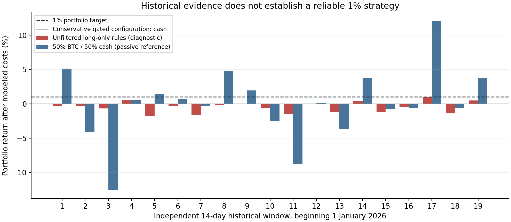

# Roostoo competition: strategy research and implementation

Prepared 9 October 2026. The objective is selective, profitable trading with controlled portfolio losses and a 1% portfolio-return benchmark.

**Finding:** the research completed here does not establish a reliable 1% strategy. The original bot infrastructure is implemented and tested, but the conservative strategy configuration failed the activity objective by remaining in cash. Variants that traded did not demonstrate a robust positive average return. Treat this as a paper-first research package, not a validated competition winner.

## 1. Constraints that change the design

The [organizer's event page](https://luma.com/coghwiyt) states: 4–17 October live trading; at least eight active days with sufficient strategy trades; an open repository due before 14 October; autonomous execution on AWS; original work and traceable commits; no HFT, market-making or arbitrage; unlevered long/short trading; $100,000 initial competition capital; market/maker fees of 0.1%/0.05% per order. Qualification first checks rules, then regional return ranking, then a 40% Sortino / 30% Sharpe / 30% Calmar composite, followed by code review.

The phrases “enough trades” and the precise trading/scoring cutoff are not specified numerically in the retrieved page. The report's one-fill daily counter and HKT-midnight end timestamp are provisional. The supplied Notion AWS guide, Notion data pack, linked FAQ and Pitch deck could not be retrieved. Their contents have not been assumed or represented as reviewed.

As of 9 October, a team with no prior active days has at most nine calendar days through 17 October, counting today. A strategy that trades only once or twice may make money and still fail qualification. Conversely, forcing tiny trades solely to accumulate days is not evidence of an autonomous profitable strategy. This bot audits activity and exposes the conflict; it does not manufacture qualifying trades.

The user's observation about few teams above 1% was not independently verified against a signed-in leaderboard. Rankings can change. The design uses 1% as a testing target, not as a known winning threshold.

## 2. Why win rate is insufficient

For a simplified fixed-payoff trade:

`expected net asset return = p × average gross win − (1 − p) × average gross loss − round-trip costs`

Example: 65% winners, a 1% average win, a 0.6% average loss and 0.3% total friction give only 0.14% expected net return on the traded asset. At 25% portfolio allocation, that is about 0.035% of portfolio equity per trade. These are illustrative assumptions, not results from our bot.

For a single position with weight `w`, approximate portfolio return is `w × net asset return`. A 1% portfolio gain at 25% allocation requires approximately 4% net on the asset, or 4.3% gross with 0.3% total modeled friction. Raising the percentage of winning trades by widening stops can worsen expected return and tail losses.

The implementation models a market round trip at 20 basis points of commissions plus 10 basis points of friction. It requires a projected target comfortably beyond that cost and checks actual historical net outcomes. The target-distance check alone is not a forecast and cannot establish profitability.

## 3. Recent research and what transfers

All papers below are primary sources. These 2026 papers are preprints; reported performance has not been independently replicated here.

| Source | Evidence | Design implication |
|---|---|---|
| [Bysik & Ślepaczuk, arXiv:2606.00060](https://arxiv.org/abs/2606.00060), *Machine Learning-Based Bitcoin Trading Under Transaction Costs* | Their walk-forward comparison found that naïve forecast-sign trading deteriorated after fees. Cost-aware thresholds reduced turnover; some XGBoost configurations performed positively. Architecture comparisons and superiority to passive holding were statistically qualified. | The main transferable idea is to test net trading outcomes and turnover. Their best annualized return is not our return and does not imply a profitable bot over nine remaining days. |
| [Kitron & Wengrowicz, arXiv:2608.21888](https://arxiv.org/abs/2608.21888), *Short-horizon mean reversion in cryptocurrency markets* | Directional reversal was measurable across many pairs, but reported gross capture peaked around 1.3 basis points per trade, below even their low-cost spot benchmark. | “Predicts the next candle” is not sufficient. Ordinary short-horizon reversal is poorly suited to our modeled execution costs. A separate, larger-excursion range hypothesis still requires its own testing. |
| [Bui & Nguyen, arXiv:2602.11708](https://arxiv.org/abs/2602.11708), *Systematic Trend-Following with Adaptive Portfolio Construction* | The authors report favorable historical results for a slower trend framework with adaptive volatility and portfolio selection. No independent replication was completed here. | This motivated testing a slower swing variant and explicit portfolio caps. Our failed variant cannot inherit their claimed Sharpe ratio, and no prohibited module is inferred from the paper. |

The defensible conclusion is that selective execution, regime dependence and costs deserve attention. There is no verified universally profitable public strategy in these sources that can simply be pasted into this competition.

## 4. Open-source implementation references

These are learning references, not evidence that their strategies will profit in this event. All delivered bot code was written originally. Third-party bot code, trained weights and README performance assertions were not incorporated.

| Repository | What to study | Caution |
|---|---|---|
| [danielchancfa/web3-quant-hackathon](https://github.com/danielchancfa/web3-quant-hackathon) | Roostoo-specific separation of collection, modeling, policy, scheduling and ATR risk management | Its model confidence or architecture does not establish calibrated probabilities of net profit. A repository description is not independently verified competition performance. |
| [freqtrade/freqtrade](https://github.com/freqtrade/freqtrade) | Bot operations, data ingestion, strategy interface, backtesting and operational protections | Roostoo requires a custom adapter. Review [lookahead analysis](https://www.freqtrade.io/en/stable/lookahead-analysis/) and [recursive analysis](https://www.freqtrade.io/en/stable/recursive-analysis/). |
| [freqtrade/freqtrade-strategies](https://github.com/freqtrade/freqtrade-strategies) | Examples of implementing indicator-based setups and exits | Examples are hypotheses, not ranked profitable strategies. Avoid copying an example and treating its name as evidence. |
| [kernc/backtesting.py](https://github.com/kernc/backtesting.py) | Event-driven simulation and explicit trade records | Custom modeling is still needed for this competition's collateralized shorts, simultaneous portfolio limits and ambiguous API writes. |
| [polakowo/vectorbt](https://github.com/polakowo/vectorbt) | Fast parameter comparisons and portfolio diagnostics | A large search space increases selection bias; preserve rejected variants and reserve later periods. |
| [mementum/backtrader](https://github.com/mementum/backtrader) | Broker/strategy separation, order lifecycle and analyzers | Historical bar fills can be more favorable than live execution; specify timing and intrabar assumptions. |
| [AI4Finance-Foundation/FinRL](https://github.com/AI4Finance-Foundation/FinRL) | Financial learning environments and research organization | Training an RL agent does not solve net-cost validation or regime changes. A new RL/Transformer model was not justified by the evidence found. |
| [binance/binance-public-data](https://github.com/binance/binance-public-data) | Public historical data format and integrity checks | Normalize spot archive microseconds, reject missing hours, and distinguish USDT spot history from Roostoo USD execution. |

## 5. Instruments and strategy suitability

The first universe is a whitelist, not the full available list. Public Roostoo metadata confirmed tradability for all ten selected pairs in the saved snapshot. Tradability is not a statement of expected profitability.

| Instruments | Candidate use | Additional restrictions |
|---|---|---|
| BTC/USD, ETH/USD, BNB/USD | Market regime reference and major-coin trend/pullback setups | Fees and positive net conditional history still have to pass; large capitalization does not guarantee alpha. |
| SOL/USD, XRP/USD, LINK/USD, AVAX/USD, AAVE/USD, SUI/USD, LTC/USD | Selective higher-volatility trend, pullback or range setups | Dynamic volume/spread filters, conservative order sizes, individual evidence, and correlated-exposure caps. |
| PAXG/USD | Potential separate commodity trend sleeve | Not enabled. Crypto BTC regimes are not appropriate by default; validate a separate signal/history/liquidity model. |
| Symbols such as NVDAB, TSLAB, MSFTB, COINB | Possible tokenized-equity research | Not enabled. Verify instrument identity, feed mapping, venue hours and stale-price behavior before applying traditional equity patterns. |
| New/small/meme/scaled symbols | Optional later research | Not enabled. Short histories, jumps, precise unit mapping and sparse liquidity weaken reliable validation. |

Owning several correlated altcoins is not equivalent to several independent positions. BTC and ETH regime data condition directional entries, and a 30% correlated group cap limits cumulative exposure even when individual positions are below their caps.

## 6. Exact candidate logic

The default strategy list contains three hypotheses:

- **Pullback:** trade a recovery across the fast moving average only while the asset and BTC agree with the slower trend, slope, ADX and efficiency checks.
- **Breakout:** trade a close beyond the previous 24-hour high/low only with the same trend confirmation and without an unusually large final candle.
- **Range reversion:** trade a recovery from a large standardized price deviation only under relatively quiet BTC and local range conditions. This is not a next-candle reversal rule.

The optional **swing trend** variant checks a two-day/eight-day EMA configuration every six hours with wider volatility-scaled barriers. It was implemented and tested, then left disabled because its results did not support recommending it.

All candidates use completed hourly bars. Signals become eligible only after the signal bar closes. Historical entries occur at the next bar's opening price with adverse friction. Live candidates expire after the first ten minutes of that next hour, rather than remaining actionable indefinitely.

For each pair/strategy/direction, the default historical admission gate requires:

- At least 25 completed, spaced setup outcomes and 12 populated 48-hour blocks in the trailing 180 days.
- Historical net winning-trade fraction at least 55%.
- Mean net asset return per setup at least 0.1%.
- Positive one-sided 90% block-bootstrap lower estimate of mean net return.

The bootstrap uses 600 deterministic draws. Cells failing any test are rejected. Grouping within blocks addresses some dependence but does not prove independence, provide simultaneous multiple-testing coverage or eliminate selection bias. The lower estimate is a conservative heuristic, not a future-return guarantee.

This admission logic is intentionally demanding. Our testing shows that it can leave the portfolio inactive for long periods. It should not be relaxed merely to print trades or retrospectively reach 1%.

## 7. Research data and chronology

The reproduction dataset includes 210 checksum-verified monthly Binance archives: ten USDT spot pairs, January 2025 through September 2026. Normalized hourly candles and archive URL/SHA-256 provenance are included. A public REST collection extended the candles into 9 October for the paper smoke test; that extension was not used to claim a prospective competition return.

The initial development comparisons used July–December 2025 competition-length episodes with earlier candles available for calibration. Tested variants included different stop/target distances, 24/48-hour holding limits, 180/365-day calibration, optional shorting and a slower swing family. Rejected variants remain in `research/development_candidates` and `research/swing_development`.

The default configuration was then evaluated retrospectively from January 2026. Nineteen full nonoverlapping 14-day windows fit before the requested October 1 exclusive endpoint; their actual last endpoint is September 24. The final seven-day partial window was omitted. This is a chronological historical test, not a claim of independently observed live out-of-sample returns. Current-whitelist survivorship and researcher choice remain limitations.

Setup labels are admitted to a day's calibration only after their exit candle has closed. Calibration is frozen at the UTC day boundary. Unit tests verify that future candles do not change past features and that truncating the input history produces the same already-known labels as a longer history. No missing hours are compressed into adjacency or forward-filled into synthetic prices.

Execution assumptions are explicit: published market fees plus five basis points friction per side; worse opening price on a stop gap; stop before target if both barriers are touched in one hourly candle; liquidation-cost equity marks; no leverage; portfolio position/correlation/loss limits; and independent episode capital resets. Live stop latency, external outages, historical spreads and exact Roostoo fill behavior are not reconstructed from these hourly Binance bars.

## 8. Results that were actually measured

Figures below are portfolio percentages, not asset returns. “Win rate” means closed trades with positive simulated P&L after modeled costs.

| 2026 retrospective comparison, 19 windows | Mean 14-day return | Best window | Worst window | Closed trades | Trade win rate | Windows above 1% |
|---|---:|---:|---:|---:|---:|---:|
| Conservative default | 0.000% | 0.000% | 0.000% | 0 | Undefined | 0/19 |
| Default, modeled costs ×1.5 | 0.000% | 0.000% | 0.000% | 0 | Undefined | 0/19 |
| Default, modeled costs ×2 | 0.000% | 0.000% | 0.000% | 0 | Undefined | 0/19 |
| Same long-only signals with evidence gate removed, diagnostic only | −0.467% | +1.024% | −1.792% | 447 | 39.15% | 1/19 |
| Optional short-enabled gated variant | −0.010% | 0.000% | −0.136% | 4 | 25.00% | 0/19 |
| Optional slower swing variant | −0.025% | +0.104% | −0.622% | 24 | 37.50% | 0/19 |

The no-gate case is a diagnostic, not a live configuration offered by the runner. Its occasional winning window does not validate it: the average was negative and most windows lost. Conversely, the default's zero drawdown and zero fees mean that it did not trade, not that a profitable trading edge survived stress tests.

For opportunity-cost context, a passive 50% BTC/50% cash reference averaged approximately +0.026% per window and exceeded 1% in 7/19 windows. A 50% equally weighted crypto/50% cash reference averaged approximately −0.063% and exceeded 1% in 8/19. These passive references were cost-adjusted but do not satisfy the trading-activity requirement. They show why measuring cash preservation alone is insufficient.

The October 1 evidence report found no accepted default cells. A subsequent public-feed paper smoke test initialized successfully, collected completed candles, evaluated decisions and kept its simulated $100,000 in cash. No authenticated exchange trade occurred during this work.

These tests do not establish a profitable strategy, a likelihood of winning, or guaranteed qualification. The strict configuration has no trades from which to estimate its winning-trade rate. The bootstrap thresholds do not rescue strategies when the underlying evidence is weak.

## 9. Operational behavior and validation

The implementation includes original official-format HMAC signing; decimal amount rounding; dedicated v6 collateralized short operations; checks of both HTTP results and JSON success; a singleton process lock; durable pre-request intents; no automatic resend of an uncertain mutation; exact fill/account reconciliation; real free-balance sizing; independent paper/live ledgers; account ownership checks; persistent stops and entry ATR anchors; fee-aware liquidation marks; portfolio risk controls; and fill/config/commit audit logs.

The authenticated short collateral convention is checked explicitly rather than double-counting locked USD. Actual account permission and accounting could not be validated without competition credentials, so shorts remain disabled by default. Existing holdings or pending orders require an audited handover from the old bot; deleting state would create unmanaged positions.

The tested local runtime was Python 3.12.14, NumPy 2.3.5 and pandas 2.2.3. All 31 critical tests passed. They cover the official signature fixture, ambiguous writes, accepted writes followed by failed reads, restart recovery, coin-denominated commission, duplicate fills, transaction rollback, single-instance exclusion, timing/data leakage, malformed data, fees, gap losses and portfolio sizing. Full test output is included.

Public preflight verified the configured instruments, precision, minimum order metadata and current quotes. The data collector and paper decision loop were exercised against public endpoints. Authenticated orders, actual fees, AWS provisioning, organizer-specific cutoff details and authenticated end-to-end exchange reconciliation were not tested.

## 10. What would justify promoting a strategy

The missing evidence is economic, not a larger model or a larger codebase. A candidate should produce positive net returns in several disjoint later periods, survive plausible cost increases, have useful trade-count uncertainty bounds, avoid dependence on one pair or one regime, and satisfy the verified activity definition without quota-only orders.

For the existing competition, inspect the team's actual earlier active days via signed read-only history, preserve existing managed holdings and logs, confirm the organizer's daily trade/cutoff definitions, and evaluate any replacement against your existing bot. This package alone does not provide a justified live replacement for a profitable or qualifying bot.

A next research hypothesis could use a tightly regularized cost-aware return model or a separately validated commodity sleeve. These are unimplemented future research possibilities, not hidden successful strategies. The implemented evidence does not support presenting any tested configuration as “the best bot” or a reliable way to beat 1%.

## Source links

Competition, original inspiration and official interfaces:

- [Event and rules](https://luma.com/coghwiyt)
- [Official Roostoo API](https://github.com/roostoo/Roostoo-API-Documents)
- [Supplied inspiration repository](https://github.com/danielchancfa/web3-quant-hackathon)
- [Binance official market-data endpoints](https://developers.binance.com/docs/binance-spot-api-docs/rest-api/market-data-endpoints)
- [Binance official public-data repository](https://github.com/binance/binance-public-data)

Unread supplied resources, preserved for your account-specific follow-up:

- [Roostoo AWS sign-in and launch guide](https://roostoo.notion.site/Hackathon-Guide-How-to-Sign-In-AWS-and-Launch-Your-Bot-309ba22fed798071b4dde6d1e8666816)
- [Roostoo data sources pack](https://roostoo.notion.site/Data-Sources-Pack-318ba22fed7980118a69c7a614995930)
- [APAC information-session deck](https://pitch.com/v/apac-quant-hackathon-info-session-zunvgj)
