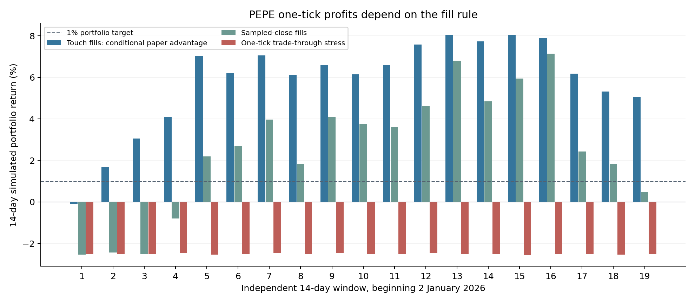

# Roostoo: paper-exchange tick strategy

Prepared 9 October 2026. Follow-up to the original hourly-strategy investigation.

**Finding:** a selective PEPE one-tick limit cycle has positive historical simulated returns when passive limits fill on trade-price touches. This is a materially better candidate than the earlier hourly strategies. Its apparent edge is sensitive to the matching rule: requiring trade-through fills makes it lose money. Actual Roostoo account fills, fees and order lifecycle remain unverified without private competition credentials. The bot therefore starts with small orders and verifies actual net execution before scaling.

## 1. The specific paper-exchange opportunity

The user clarified that sequential tick scalping is permitted in this competition. The implementation records that clarification as its permission basis. The public event description separately prohibits HFT, market-making and arbitrage. This version uses one sequential directional cycle and one outstanding order, conservative polling and an entry-attempt cap. It does not assume the clarification extends to latency arbitrage or unrestricted two-sided quoting.

The public Roostoo metadata and quotes were collected on 9 October at approximately 14:50 UTC. One price tick is surprisingly large for several low-price instruments. With maker fees of 0.05% on each leg, a round trip needs just over 0.10% gross price appreciation, before rounding and other execution losses.

For USD-denominated entry commission, `net return = sell_price × (1 − sell_fee) / [buy_price × (1 + buy_fee)] − 1`. For coin-denominated entry commission, use `sell_price × (1 − buy_fee) × (1 − sell_fee) / buy_price − 1`. The runner uses the less favorable convention for admission and actual balances for inventory.

| Instrument | Observed price | Roostoo tick | Gross one-tick move | Approximate net successful cycle |
|---|---:|---:|---:|---:|
| BONK/USD | 0.00000332 | 0.00000001 | 0.3012% | 0.2010% |
| PEPE/USD | 0.00000388 | 0.00000001 | 0.2577% | 0.1575% |
| SHIB/USD | 0.00000537 | 0.00000001 | 0.1862% | 0.0861% |
| WLFI/USD | 0.0536 | 0.0001 | 0.1866% | 0.0864% |
| BTC/USD | 83023.99 | 0.01 | 0.000012% | -0.1000% |

These are economics conditional on both maker orders filling at the specified prices, not expected strategy returns. STO, 1000CHEEMS, HEMI and LISTA also had positive one-tick fee arithmetic in the snapshot, but sparse liquidity, weak tests or low margin kept them outside the default whitelist. Tick-to-price ratios change with price; the bot recomputes them each entry.

The hypothesized advantage is that a paper exchange might fill a resting limit without realistic queue competition or market impact. That can favor a small buy-and-rebound cycle at coarse price increments. This behavior is not established by a public ticker. A limit label also does not guarantee the maker fee: the order's role and actual commission must be checked.

## 2. Strategy and similar ideas tested

The initial candidate is a buy limit one tick below the most recent completed trade-price proxy, followed by a sell limit one tick above the entry. A three-tick stop, an additional one-tick loss allowance, a 30-minute holding limit, five-minute entry expiry, three-minute cooldown and a 24-cycle daily cap constrain inventory risk. Entry decisions use completed data at five-minute intervals. Falling-price and low-volume filters reject weak setups.

Six exploratory families were evaluated across eight instruments: the one-tick cycle; a two-tick target; an entry directly at the prior close; a quiet-market filter; an aggressive-buy-volume filter; and a longer holding period with a wider stop. Forty-eight candidate/instrument comparisons are retained, including failures. The two-tick PEPE target had a lower win rate and less stable results. Direct prior-close entries were poor. Quiet and volume-filtered variants looked somewhat better under touch fills but did not resolve the matching uncertainty; they are not substituted into the default after inspecting later results.

The operational runner is intentionally more cautious than this bar proxy: it buys one tick below the actual Roostoo bid; rounds the target up; keeps a sell limit above the executable bid; and raises the target when necessary to cover actual cost and the minimum net margin. It observes thirty-second public quotes and uses a short history of those quotes for stabilization. Historical trade-price bars do not establish the same fills as this quote-based runner.

Only PEPE is enabled initially. BONK and SHIB remain research alternatives because their sampled-fill tests were weaker. A separate slower seven/fourteen/thirty-day major-coin trend ensemble was also compared; its negative median and several-percent losing windows did not support replacing the primary candidate.

## 3. Data, timing and fill assumptions

The new dataset contains 3,237,120 actual one-minute candles across eight Binance USDT spot instruments, from 1 January through 8 October 2026. All 136 published monthly/daily archives passed SHA-256 verification. Each instrument has 404,640 rows with no minute gaps. Normalized compressed CSVs, provenance, and original research scripts are included.

The three fill models deliberately differ:

- **Touch:** a pending buy fills if a subsequent traded minute's low reaches its limit; a pending sell fills if a later minute's high reaches its limit. Full quantity and no queue competition are assumed. This is the proposed paper advantage, not a verified venue behavior.
- **Sampled close:** fill tests use minute closing prices, with actual trade activity required. This can miss brief excursions and still does not model executable bid/ask quotes or queue competition.
- **Trade-through:** entry requires a price one tick below its limit and exit requires a price one tick above its limit. This stresses additional price/spread/queue requirements; it is not asserted to be Roostoo's actual rule.

No entry and profit-target exit are credited in the same minute. Entry-bar stop ambiguity is adverse. Stop gaps use the worse opening/stop price plus one tick, and stops/timeouts pay the taker fee. Portfolio equity is marked after estimated liquidation costs. Daily loss halts reset on the next simulated UTC day; peak drawdown halts persist for the episode. The actual runner uses HKT daily boundaries.

The tests use current metadata as fixed historical precision and Binance USDT as a Roostoo USD proxy. Historical spreads, real order queue positions, partial fills and live latency are not reconstructed. Instrument and model selection were exploratory; the later-period comparison is retrospective validation, not an untouched prospective holdout. Strong apparent touch-fill returns are grounds to test matching, not evidence that Roostoo must reproduce them.

## 4. Measured returns after modeled fees

Nineteen independent fourteen-day episodes run from 2 January through 25 September 2026, resetting capital to $100,000. These figures assume the full-size research policy: at most 15% asset allocation, planned stop risk at most 0.15% of equity, and one position. They do not include the operational runner's initial $100 verification stage.

| PEPE configuration | Mean 14-day return | Median | Worst window | Trade win rate | Windows above 1% |
|---|---:|---:|---:|---:|---:|
| One-tick touch fills | +5.807% | +6.219% | -0.110% | 97.31% | 18/19 |
| One-tick sampled closes | +2.523% | +2.686% | -2.530% | 90.65% | 14/19 |
| One-tick trade-through | -2.511% | -2.519% | -2.567% | 42.17% | 0/19 |
| Touch fills, fees increased 50% | +3.771% | +4.024% | -0.153% | 97.82% | 16/19 |
| Touch fills, entry two ticks below prior close | +4.910% | +5.065% | +0.635% | 98.11% | 18/19 |

The base touch case closed 6,275 trades; its worst intraperiod drawdown was 0.924%. Provisional activity exceeded eight UTC days in all nineteen episodes. That is not organizer-confirmed compliance, because the exact daily trade requirement remains unspecified and the runner uses HKT boundaries.

The additional 1-8 October comparison is especially relevant to the ongoing event: touch fills returned +2.979% with 192 cycles and 97.92% winners; sampled closes returned -0.897%; trade-through returned -2.494% and hit the drawdown halt. The same price history yields different conclusions under different matching rules.

Over 1 September through 8 October, the continuous touch simulation returned +13.988%, sampled closes +1.108%, and trade-through -2.504%. The sampled case eventually halted despite finishing above its initial capital. A conditional daily bootstrap is included, but it cannot provide a confidence bound for an unknown matching engine or correct exploratory selection bias.

## 5. What the updated bot actually does

The new `tick-run` command defaults to local shadow mode and a separate durable ledger. The `paper-exchange` mode routes signed requests to Roostoo's mock endpoint using private environment credentials. Shadow fills are never recorded as competition trades, and the ledgers are not pooled.

On the mock account, initial entries are capped at $100. Size increases only after at least twenty closed samples for that instrument, at least 80% positive net outcomes and a positive one-sided descriptive bootstrap estimate. This verifies observed economics on the account; twenty samples are not a proof of a permanent edge. After verification, the normal position/risk caps still apply. Unexpected taker classification or excessive limit commission blocks further entries.

The order state machine persists intent before transmission, retains unknown responses across restarts, requires unique matching history before accepting a recovered order, owns partial buy inventory, and waits for terminal cancellation plus reconciled balances before replacing an exit. Coin fees reduce actual sellable quantity. It never opens a sell without inventory, averages down, submits broad cancel-all requests, or resends an uncertain mutation. Existing holdings/pending orders require an audited handover.

Forty-six critical tests passed, including the existing thirty-one and fifteen new tick tests. The new checks cover tick arithmetic, signed limit/cancel requests, no fill on the submission snapshot, quote-based shadow matching, transaction rollback, restart recovery, duplicate matching orders, cancellation races, partial execution fields, actual coin fees, fee-role changes, probe isolation and realistic research position sizing. The documented pending-quantity echo is normalized only when zero execution fields and unchanged balances independently confirm no fill.

A public-data startup smoke test passed. Thirty real public quote snapshots spanning about eighteen minutes were replayed; neither conservative quote matching nor last-price matching completed a cycle with the initial configuration. These observations are not orders and do not establish the exchange fill rule. No authenticated trade or AWS deployment occurred during this research.

## 6. Running and checking the candidate

Install dependencies using the README, then run `python -m sentinel tick-run --mode shadow`. The first several minutes warm up real quote history. For authenticated mock operation, privately provide `ROOSTOO_API_KEY` and `ROOSTOO_SECRET_KEY` through the EC2 environment and use `python -m sentinel tick-run --mode paper-exchange`. A dedicated systemd example is supplied. Do not run it concurrently with the earlier bot; they share an instance lock. Preserve the exchange ledger on redeployment.

Inspect actual maker roles, commissions, fill prices, time to fill, cancellation results, and realized net returns from the initial small orders. If the touch advantage is absent, leave the strategy small or inactive. Repeatedly unsuccessful probes must not be interpreted as validation. The initial probe stage can run indefinitely if its criteria fail.

The exact competition cutoff remains provisional. The runner starts liquidation five minutes before the configured cutoff, but client-side stops, network outages, unresolved writes and cancel/fill races can delay exits. Planned risk and drawdown limits are controls, not guaranteed maximum losses. Stopping the service does not flatten holdings.

## Source links

- [Official competition description and fees](https://luma.com/coghwiyt)
- [Official Roostoo API, precision and order lifecycle](https://github.com/roostoo/Roostoo-API-Documents)
- [Binance public archive format and checksums](https://github.com/binance/binance-public-data)
- [Primary research: fill probability versus post-fill returns](https://arxiv.org/html/2502.18625v2)
- Additional inspiration: [Sigma Gate](https://github.com/DhmalTPS/Sigma-Gate-Crypto-Trend-Allocation) and [quant competition deploy](https://github.com/weiyuanoh/quant-competition-deploy)

Queue research motivates fill-quality checks; its results and repository claims do not validate this bot. The implementation is original. Supplied Notion/Pitch documents could not be retrieved.
